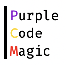

# MarkDown(마크다운) 문법 정리

## 제목(Header)

---

html의 제목 태그`(<h1> ~ <h6>)`를 표현 할 때 사용함

```markdown
# 제목 1
## 제목 2
### 제목 3
#### 제목 4
##### 제목 5
###### 제목 6
```

# 제목 1

## 제목 2

### 제목 3

#### 제목 4

##### 제목 5

###### 제목 6

## 강조(Emphasis)

---

내용을 강조하기 위한 표현

```markdown
이텔릭체(<em>) : *이텔릭체* or _이텔릭체_
두껍게(<strong>) : **bold** or __bold__
 - 별표(*)와 언더바(_)를 혼용하여 사용하면 이텔릭체와 bold처리를 동시에 적용 가능
취소선(<del>) : ~~취소선~~
밑줄(<u>) : <U>밑줄</U>
 - html태그와 동일하게 <u>를 사용함
```

*이텔릭 체*

**bold**

~~취소선~~

<U>밑줄</U>

## 목록(list)

---

목록 태그`<ol>`, `<ul>` 를 나타내기 위한 문법

```markdown
1. 1번 주제
	1. 1-1번 설명
	2. 1-2번 설명
2. 2번 주제
	- 2-1번 설명
	- 2-2번 설명

- ul 1
- ul 2
	- ul 2-1
	- ul 2-2
```

1. 1번 주제
    1. 1-1번 설명
    2. 1-2번 설명
2. 2번 주제
    - 2-1번 설명
    - 2-2번 설명

- ul 1 내용
- ul 2 내용
    - ul 2-1 내용
    - ul 2-2 내용

## 링크(link)

---

html의 링크 `<a>` 태그를 작성하는 방법

```markdown
[title](link "description")
[GitHub](https://github.com "GitHub링크입니다.")
[home](../ "상대경로")
[purpleCode53][home link]
[home link]: https://purplecode53.github.io/ "링크를 참조하여 사용 가능"
```

[title](link "description")  
[GitHub](https://github.com "GitHub링크입니다.")  
[home](../ "상대경로")  
[purpleCode53][home link]  
[home link]: https://purplecode53.github.io/ "링크를 참조하여 사용 가능"  

## 이미지(image)

---

html의 이미지 `` 태그를 작성하는 방법

```markdown


이미지 + 링크
[][home link]
```
### 이미지

### 이미지+link
[][home link]

## 인라인(inline) 코드

---

html의 `<code>` 태그로 내용 중간에 코드를 강조하기 위한 문법

```markdown
내용 작성 중 `backtick`으로 감싸면 내용 중간의 코드를 강조할 수 있음
```

내용 작성 중 `backtick`으로 감싸면 내용 중간의 코드를 강조할 수 있음

## 블록(block) 코드

---

여러 줄의 코드를 입력할 때 사용되며 `<pre><code></code></pre>` 의 형태로 나타남

```markdown
backtick(`)을 3회 연속하여 입력하여 사용 한다.
`` `language
code1(){};
code2(){};
`` `

`` `javascript
function func(){
	let msg = 'message';
	return msg;
}	
`` `

`` `css
.container ol li, .container ul li {
    padding: 5px 0;
}
`` `

`` `java
public class HelloWorld {
    public static void main(String[] args) {
        System.out.println("Hello, world!");
    }
} 
`` `
```

```javascript
function func(){
	let msg = 'message';
	return msg;
}	
```

```css
.container ol li, .container ul li {
    padding: 5px 0;
}
```

```java
public class HelloWorld {
    public static void main(String[] args) {
        System.out.println("Hello, world!");
    }
}  
```

## 표(table)

---

html의 테이블 태그`<table>`를 표현하는 문법

```markdown
|기본값|왼쪽 정렬|가운데 정렬|오른쪽 정렬|
|---|:---|:---:|---:|
|index1|왼쪽1|가운데1|오른쪽1|
|index2|왼쪽2|가운데2|오른쪽2|
|index3|왼쪽3|가운데3|오른쪽3|
```

| 기본값 |왼쪽 정렬|가운데 정렬|오른쪽 정렬|
| ------ |:------- |:---------:| ---------:|
| index1 | 왼쪽1 | 가운데1 | 오른쪽1 |
| index2 | 왼쪽2 | 가운데2 | 오른쪽2 |
| index3 | 왼쪽3 | 가운데3 | 오른쪽3 |

## **인용문(BlockQuote)**

---

html의 `<blockquote>` 태그를 표현하는 문법

```markdown
인용문
> '>'를 이용하여 인용문을 작성할 수 있다.
>> ‘>’의 개수에 따라 중첩된 인용문을 만들 수 도 있다.
```

인용문

> ‘>’를 이용하여 인용문을 작성할 수 있다.
>> ‘>’의 개수에 따라 중첩된 인용문을 만들 수 도 있다.

## **수평선(Horizontal Rule)**

---

수평선을 나타내는 방법

```markdown
---, ***, ___
각 기호를 3회 이상 반복하여 사용하면 수평선을 표현할 수 있다.
```

---

***

___

각 기호를 3회 이상 반복하여 사용하면 수평선을 표현할 수 있다.